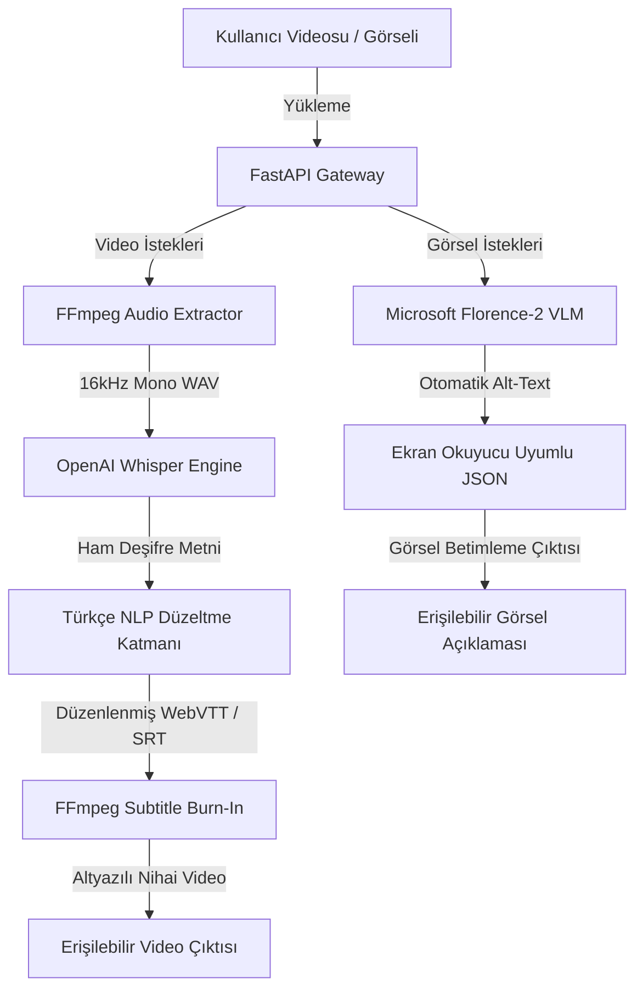

# NSosyal - Yapay Zekâ Destekli Erişilebilir Sosyal Medya Asistanı

NSosyal, sosyal medya platformlarındaki (Instagram, YouTube, TikTok, X vb.) görsel ve işitsel içerikleri, görme ve işitme engelli bireyler için erişilebilir hale getirmeyi hedefleyen açık kaynaklı ve yerel (on-premise) bir yapay zekâ asistanıdır.

---

## Hızlı Bağlantılar

*   **Google Colab Prototipi (Canlı Demo):** [NSosyal Colab Defterini Çalıştır](https://colab.research.google.com/drive/1jLpVJ6HjMsEpxhpMOCnGCFIxipFitemdj04ojhk9dwo)
*   **Tasarım Standartları:** W3C / WCAG 2.1 Yönerge 1.1.1 & Level AA Uyumlu

---

## Öne Çıkan Özellikler

*   **Otomatik Türkçe Altyazı Giydirme (ASR/STT):** OpenAI Whisper (Turbo) ve FFmpeg kullanarak videolardaki konuşmaları çözümler ve video üzerine kalıcı altyazı (hardsub) olarak işler.
*   **Görsel Betimleme (VLM):** Microsoft Florence-2 modelini kullanarak durağan görselleri detaylı Türkçe açıklamalara (alt-text) dönüştürür.
*   **Yerel Barındırma (Self-Hosted):** Sıfır üçüncü parti API maliyetiyle kendi sunucumuzda çalışarak KVKK veri güvenliği regülasyonlarına tam uyum sağlar.
*   **Kullanıcı Düzeltme Arayüzü:** Yapay zekânın gürültülü ortamlarda yapabileceği küçük fonetik hataları son çıktıdan önce düzeltme imkanı sunar.

---

## Sistem Mimarisi ve Veri Akış Diyagramı (DFD - Seviye 1)

Platforma yüklenen içeriklerin işleme adımları ve veri yolları aşağıda gösterilmiştir:


```
API Entegrasyon Sözleşmeleri
1. Altyazı Üretim Servisi (POST /api/v1/subtitles)
İstek Yapısı (Request Payload):
json


{
  "job_id": "job_987654321_v3",
  "video_url": "https://storage.erisilebilir.destek/raw-videos/ornek_video.mp4",
  "options": {
    "model_size": "turbo",
    "clean_disfluency": true
  }
}
Yanıt Yapısı (Response Payload):
json


{
  "module": "automatic_captioning",
  "status": "success",
  "outputs": {
    "vtt_url": "https://storage.erisilebilir.destek/subtitles/ornek_video.vtt",
    "srt_url": "https://storage.erisilebilir.destek/subtitles/ornek_video.srt"
  }
}

2. Görsel Betimleme Servisi (POST /api/v1/analyze)
İstek Yapısı (Request Payload):
json


{
  "image_url": "https://storage.erisilebilir.destek/raw-images/ornek_gorsel.png",
  "task": "more_detailed_caption"
}
Yanıt Yapısı (Response Payload):
json


{
  "module": "image_description",
  "status": "success",
  "outputs": {
    "alt_text": "TEKNOFEST alanında dalgalanan Türk bayrakları ve ziyaretçi kalabalığı."
  }
}

Kalite Güvence (QA) ve Entegrasyon Testleri
API doğrulama senaryoları, FastAPI TestClient ve pytest aracılığıyla simüle edilmiş ve tam başarıyla (PASS) geçmiştir:

test_subtitle_health_check ➔ BAŞARILI (HTTP 200 OK)
test_empty_video_file_validation ➔ BAŞARILI (HTTP 422 Unprocessable Entity)
test_unsupported_video_file_extension ➔ BAŞARILI (HTTP 400 Bad Request)
test_valid_video_upload ➔ BAŞARILI (HTTP 200 OK)
test_empty_subtitle_text_payload ➔ BAŞARILI (HTTP 422 Unprocessable Entity)

Kurulum ve Çalıştırma
Projenin yerel ortamda çalıştırılabilmesi için gerekli adımlar:

Gereksinimlerin Kurulması:
bash


pip install openai-whisper gradio torch gTTS pytest fastapi uvicorn
FFmpeg Kurulumu: Sisteminizde FFmpeg yüklü ve PATH ortam değişkenine eklenmiş olmalıdır.
Prototipin Çalıştırılması:
bash


python nsosyal_poc_stt.py <video_dosyası_yolu>
